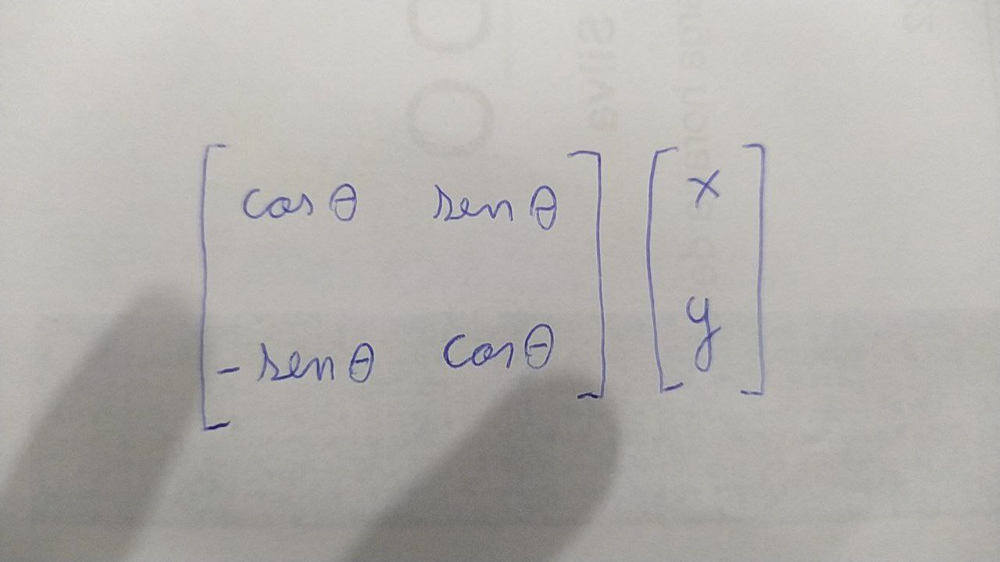
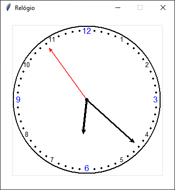

# relogio_tkinter
Relógio de ponteiro desenvolvido com Python + Tkinter com base na Matriz de Rotação da teoria das transformações lineares da Álgebra Linear

<h2>Matriz de rotação</h2>
 

Para calcular o horário do relógio de ponteiro utilizei a multiplicação de matrizes entre a Matriz de Rotação e a Matriz de coordenadas do ponteiro. A cada segundo que se passa, essa multiplicação é realizada utilizando 6° como ângulo de rotação, representando a medida de tempo. Essa lógica foi feita para calcular a mudança de posição para os ponteiros de segundos, minutos e horas.

 

